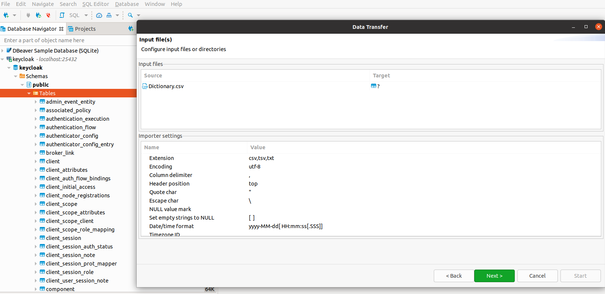
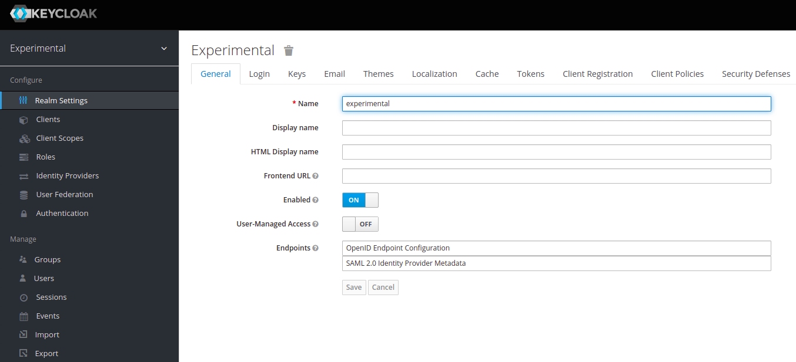
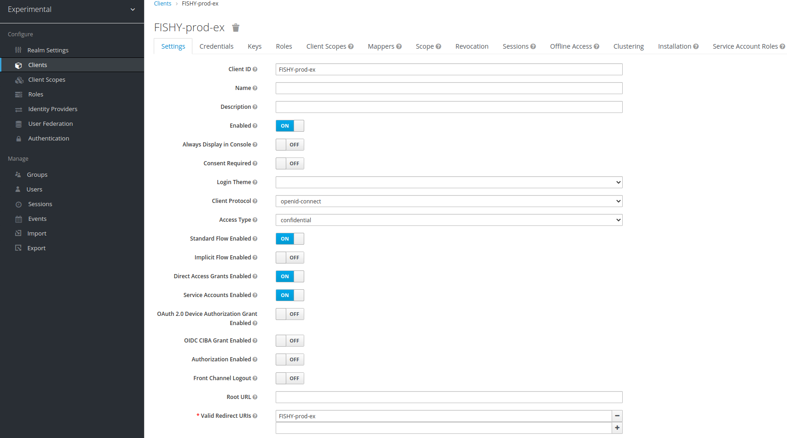

# FISHY-SPI
Description of the FISHY SPI component interface.
## Introduction
This example shows the details from installation to integration of the tools used in SPI development. Here we will briefly describe the steps that we must follow to have a basic deployment of the module.
We'll start by defining some basic concepts and then describing the installation and integration of the keycloak, Kong(API Gateway) with RabbitMQ and a template client, written in Python and Java. To facilitate testing and visualization of the information, we will use a GUI called Konga, an open-source tool, developed by the community, attention that this tool will be used for testing purposes. We end with a brief description of the framework developed to test the module, including a prototype producer and consumer, both written in Python.
## Fundamentals
### Keycloak context
[Keycloak](https://www.keycloak.org/) will be used as an Authorization Service (AS). It will provide authentication and authorization protocols. As an implementation of the OpenID and OAuth2 protocols, Keycloak supports user authentication, locally or in a federation, and application authentication. In this case, we are mainly interested in this last aspect, namely the so-called [Client Credential Flow](https://auth0.com/docs/authorization/flows/client-credentials-flow).
#### Realm
A realm manages a set of users, their credentials, **roles**, and **groups**. A user belongs to and logs into a realm. Realms are isolated and obviously can only manage and authenticate users under their control.
#### Client and Scopes
When a client is registered, we must define its **protocol mappers** and **role scope** mappings.
### Kong API Gateway
[Kong](https://konghq.com/) An API gateway acts as a reverse proxy to accept all application programming interface (API) calls, aggregate the various services needed to service them and return the appropriate result. In our case, it will be used to manage all calls and integrated with keycloak, to perform token validations and direct calls to their respective endpoints.
### Konga GUI
[Konga](https://pantsel.github.io/konga/) It is only used to facilitate testing and visualization of configurations that are running on kong. Attention, using this tool is for testing purposes.
### RabbitMQ context
[RabbitMQ](https://www.rabbitmq.com/) will be used as a message broker. After **publishers** (or **producers**) are authenticated and authorized, they can start sending messages to specific queues in RabbitMQ, which will keep the data in those queues. The information at queues stays available for **consumers** that previously subscribed to each one. <u>Qeues are not persistent</u> meaning consumers must store the data if required.
## Installation
## Docker
Make sure you have docker installed.

## Clone the repository
```$git clone https://github.com/hdsantos/FISHY-SPI.git```

## Starting the containers

* ```$cd FISHY-SPI```
* ```$docker-compose up -d keycloak-db kong-db```
* ```$docker-compose run --rm kong kong migrations bootstrap```
* ```$docker-compose up -d```

Check if all containers are running

* ```$docker ps```

## Importing Metrics Database
This database has a dictionary that maps the metrics worked so far and also serves so that the client can create queues for each type of metric.
- > **Note**: This database is under construction. According to the progress of research done in metrics, there will be updates on it. At the moment the information is real.
- > **Note**: To make these settings, we use a **DBeaver**.

Access the BD folder and import the Dictionary.cvs, into the same instance of the keycloak database. You should name it "Dictionary".




At this point all services are expected to be running, and we can start the configuration.

### Login to the Keycloak Admin console
Using the URL: ```http://localhost:8180/auth/```, enter the **Keycloak Admin Console**, and log in using the previously chosen credentials(**user: admin, password: admin**).

### Create a Realm
A realm in Keycloak is the equivalent of a tenant. There is a single domain in Keycloak called **master** by default. This is dedicated to Keycloak management and should not be used for other purposes. To create the first realm:
- Hover over the top left corner where it says Master and click on **Add Kingdom**.
- Fill in the form (the only mandatory field is **Name**).
- Select **Create**, and we will get the **General** page for the **experimental** domain, as shown in Figure 1, and where we can add additional information (don't forget to click **Save**, if necessary).



## Create Clients

### Kong Client(API Gateway)
In the following example, we will need two clients the first one we will create is Kong this client will be responsible for the communication between the keycloak and the Kong (API Gateway).
- In the drop-down list in the upper left corner, select the domain created earlier (Experimental in the example, if not already selected).
- Click on **Customers** on the left side menu to open the Customers page.
- On the right side, click **Create**.
- We will create an **application client**. In the **Add Client** dialog, provide a unique ID (eg **kong**) and select the **OpenID-connect** protocol. After clicking **Save**, we get the client configuration page.
- On the **kong client page** that appears, configure the fields as shown in Figure 2.


- **NOTE**: we must first select the **Access Type** as **confidential**. Then enable the **Service Accounts Enabled** option. This parameter activates the authentication flow that we intend to use in this example (**Client Credentials Flow**, as already mentioned).
- Next, we must fill in the **Valid Redirect URIs** field, which will be the entry point for client redirects (```/mock/*``` in our example), even if we do not use it, as in our example. You also need to fill in the Root URL (```http://localhost:8000```), receive incoming HTTP traffic from Consumers, and forward it to upstream Services. Don't forget to click **Save**.
- Finally, we must select the **Credentials** tab and copy the **Secret** to this customer ID (kong), which we will embed in the customer code below.

### FISHY-prod-ex Client(second client)
In the same way that the previous client was created, we will do the same. We created the client with the name **FISHY-prod-ex**.
- On the **FISHY-prod-ex client page** that appears, configure the fields as shown in Figure 3.



- **NOTE**: we must first select the **Access Type** as **confidential**. Then enable the **Service Accounts Enabled** option. This parameter activates the authentication flow that we intend to use in this example (**Client Credentials Flow**, as already mentioned).
- Next, we must fill in the **Valid Redirect URIs** field, which will be the entry point for client redirects (```FISHY-prod-ex``` in our example), even if we don't use it, as in our example. In this case, you will not need more configurations, because the one who will manage the entire flow will be Kong. Don't forget to click **Save**.
- Finally, we must select the **Credentials** tab and copy the **Secret** to this customer ID (FISHY-prod-ex), which we will embed in the customer code below.

### Testing and template
The client we are going to use was built in Python (```FISHY-prod-ex```)

For authentication, it is necessary to pass the parameters **Client ID**, **Client Secret** (obtained previously), and **Scope** (with an optional scope value, email in the examples, but it could be anything else). The call must be made to the proper **token endpoint**. The “grant type” specifies the flow to use – in the examples provided, ‘client_credentials’ denotes **CCF** (**Client Credential Flow**).

In addition to the above mentioned settings, you will need some minor tweaks to ```FISHY-prod-ex```.
- On line 31 of the code, you will find this code snippet: ```with open('/home/alan/Documents/Code/FISHY-SPI/producer/PT1H.json') as f:``` Change to your scenario.
- On line 49 of the code, you will find this code snippet: ```host = os.environ["HOST_IP"]keycloak_client_secret = os.environ["CLIENT_SECRET"]keycloak_realm = os.environ["REALM"]``` create a file to save environment variables and their values.

[Example in Python](producer/FISHY-prod-ex.py)


### Accessing RabbitMQ

We can access the RabbitMQ main page using the URL ```http://localhost:8080```, and using the default username and password, **guest**. Figure 5 shows the main page, from where we can monitor the activity and perform some configurations, like creating queues and logins management (as usual, it is recommended to modify the default administration login).
- **Note**: concerning queues creation, it is unnecessary to perform it from the management site since producers can also make it when sending data.
- **Note**: In the menu above, click on QUEUES, to be able to view the information that the client (```FISHY-prod-ex```) sent and the queues that were created.


## Framework for testing SPI
Now we need a **producer** and a **consumer** to test the complete architecture. The producer will be capturing raw data from the infrastructure. Within the FISHY architecture, this producer is one or more modules at the SIA level. However, as there is no prototype available to work with, we will use a simple simulator agent that reads real log files, applies the necessary transformations, and sends the data to the broker after authentication.

The current [Python producer code](FISHY-prod-ex.py) is focused on the required format transformation from raw data to classified events following the evolving taxonomy, then it goes through the authentication process with the infrastructure, and lastly, send the messages to the respective queues in EabbitMQ. To support this transformation, we deploy a simple database.

The consumer will be integrated into the TIM and SCM modules. Again, as we don't have these prototypes yet, the consumer is currently under development with the authentication process already included.

The current [Python consumer code](FISHY-cons-ex.py) is also a simpler version, it is already being developed with the implementation of the authentication process.

## Visualization - Konga (GUI)
You can view through Kong(GUI), all the settings made here.

- Access ```http://localhost:1337/```, and create a user, as shown in Figure 6.


- Then configure your connection with kong API, as shown in figure 7.


After these steps, you can see in the menus all the services, routes, and plugins that have been configured through our client (```FISHY-prod-ex```).
- **Note**: The use of konga(GUI), is for test environment only.
